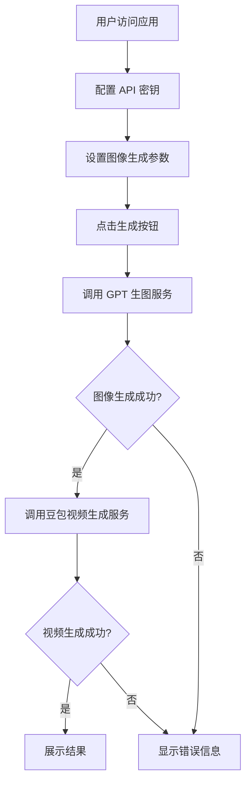

## 1. Product Overview
一个网页应用，用于自动调用 GPT 图像生成服务生成图片，然后将生成的图片调用豆包服务生成视频。支持用户配置 API 密钥和参数，展示生成过程和结果。

## 2. Core Features

### 2.1 Feature Module
1. **主页面**: API 配置、图像生成参数设置、任务状态展示
2. **结果页面**: 生成的图像和视频展示

### 2.3 Page Details
| Page Name | Module Name | Feature description |
|-----------|-------------|---------------------|
| 主页面 | API 配置 | GPT 生图服务 API 和豆包视频生成服务 API 的配置，包括端点 URL 和密钥 |
| 主页面 | 参数设置 | 图像生成提示词、尺寸、风格等参数设置 |
| 主页面 | 任务执行 | 一键执行图像生成和视频生成 |
| 主页面 | 任务状态 | 实时显示任务执行进度和状态 |
| 结果页面 | 结果展示 | 显示生成的图像和视频，支持下载 |

## 3. Core Process
用户访问应用 → 配置 API 密钥 → 设置图像生成参数 → 点击生成按钮 → 应用调用 GPT 生图服务 → 生成图片成功 → 应用调用豆包视频生成服务 → 生成视频成功 → 展示结果

## 4. User Interface Design
### 4.1 Design Style
- 主色调：深蓝色 (#1e3a8a) 和浅蓝色 (#60a5fa)
- 按钮风格：圆角渐变按钮，带悬停效果
- 字体：使用 Inter 字体，现代简洁
- 布局风格：卡片式布局，分区清晰
- 图标风格：使用 lucide-react 图标库

### 4.2 Page Design Overview
| Page Name | Module Name | UI Elements |
|-----------|-------------|-------------|
| 主页面 | 配置区域 | 卡片式布局，左侧配置 API，右侧设置参数 |
| 主页面 | 执行区域 | 大尺寸生成按钮，下方任务状态显示 |
| 主页面 | 结果展示 | 响应式网格布局，显示图片和视频 |

### 4.3 Responsiveness
桌面端优先设计，支持响应式布局，适配平板和移动端

