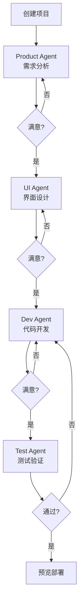
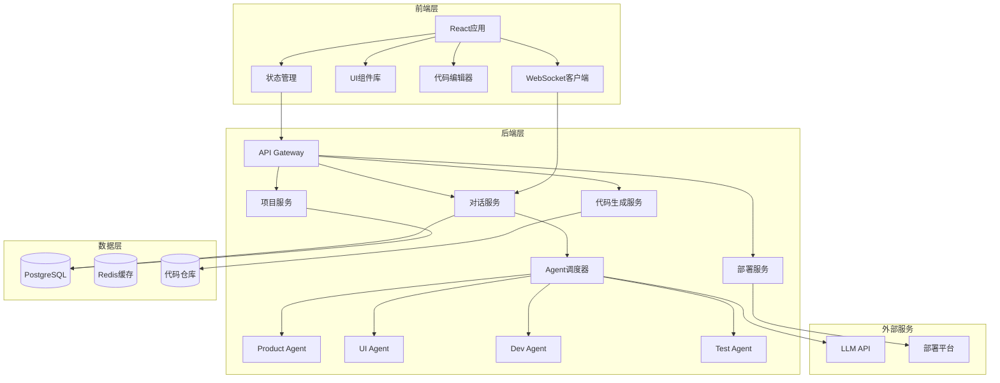
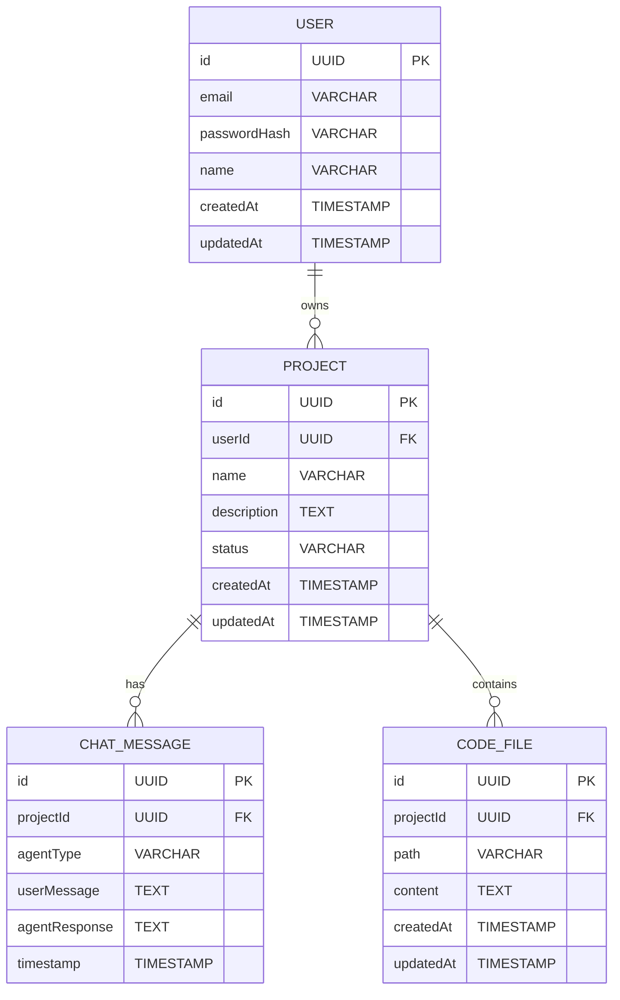
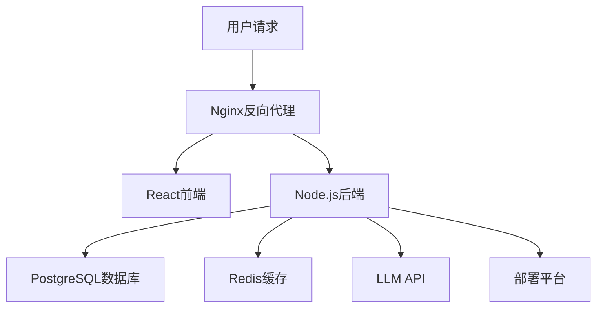

# 企业级VibeCoding智能体项目

---

## 一、PRD文档

### 1. 产品概述
VibeCoding是一个企业级的对话式AI智能体开发平台，通过内置的产品、UI、开发和测试agents，让用户以自然语言对话的方式逐步完善和修复应用，最终实现应用落地。

**主要目标：**
- 降低应用开发门槛，让非专业开发者也能通过对话创建应用
- 提供一站式开发体验，覆盖产品设计到测试上线全流程
- 通过持续对话迭代，不断完善应用功能和质量

---

### 2. 核心功能

#### 2.1 用户角色
| 角色 | 注册方式 | 核心权限 |
|------|----------|----------|
| 开发者 | 邮箱/社交账号注册 | 创建项目、与agents对话、部署应用 |
| 管理员 | 系统后台配置 | 用户管理、系统配置、日志查看 |

#### 2.2 功能模块
1. **项目管理**：创建/管理开发项目
2. **对话中心**：与各agents进行自然语言交互
3. **代码编辑器**：实时查看和编辑生成的代码
4. **预览部署**：预览应用效果并一键部署

#### 2.3 内置Agents
| Agent名称 | 职责 | 核心能力 |
|-----------|------|----------|
| Product Agent | 产品需求分析 | 需求梳理、功能规划、用户故事编写 |
| UI Agent | 界面设计 | 组件设计、样式规范、交互原型 |
| Dev Agent | 代码开发 | 功能实现、代码优化、技术方案 |
| Test Agent | 测试验证 | 测试用例、自动化测试、Bug修复 |

#### 2.4 页面详情
| 页面名称 | 模块名称 | 功能描述 |
|----------|----------|----------|
| 首页 | 项目列表 | 展示用户创建的所有项目，支持创建新项目 |
| 对话页 | 智能对话 | 与各agents进行自然语言对话，实时获取反馈 |
| 编辑器页 | 代码编辑 | 查看和编辑生成的代码，支持语法高亮 |
| 预览页 | 应用预览 | 实时预览应用效果，支持调试模式 |

---

### 3. 核心流程

**用户创建应用流程：**
1. 用户创建新项目
2. 与Product Agent对话，描述需求
3. Product Agent输出需求文档和功能规划
4. 与UI Agent对话，确定界面设计
5. UI Agent输出设计稿和组件规范
6. 与Dev Agent对话，实现功能
7. Dev Agent输出代码实现
8. 与Test Agent对话，进行测试验证
9. Test Agent输出测试报告和Bug修复建议
10. 预览并部署应用



---

### 4. 用户界面设计

#### 4.1 设计风格
- **主色调**：科技蓝 (#1E40AF)，体现专业和创新
- **辅助色**：活力橙 (#F97316)，用于强调和交互元素
- **按钮风格**：圆角矩形，hover时有微动画效果
- **字体**：Inter，现代无衬线字体
- **布局**：左侧导航 + 右侧内容区的经典开发工具布局
- **图标**：使用Lucide图标库，简洁现代

#### 4.2 页面设计概览
| 页面名称 | 模块名称 | UI元素 |
|----------|----------|--------|
| 首页 | 项目卡片 | 卡片式布局，展示项目名称、状态、最后更新时间 |
| 对话页 | 聊天界面 | 消息气泡、Agent选择器、发送按钮、历史记录 |
| 编辑器页 | 代码编辑区 | 代码高亮、行号、折叠展开、格式化按钮 |
| 预览页 | 应用展示区 | iframe预览、调试控制台、部署按钮 |

#### 4.3 响应式设计
- 桌面端：完整功能展示
- 平板端：自适应布局，保持核心功能
- 移动端：简化布局，重点突出对话功能

---

## 二、技术架构文档

### 1. 架构设计



---

### 2. 技术选型

| 分类 | 技术 | 版本 | 说明 |
|------|------|------|------|
| 前端框架 | React | 18.x | 主流前端框架，生态成熟 |
| 构建工具 | Vite | 6.x | 快速构建，热更新 |
| 样式框架 | TailwindCSS | 3.x | 原子化CSS，快速开发 |
| 状态管理 | Zustand | 4.x | 轻量级状态管理 |
| 代码编辑器 | Monaco Editor | 0.x | VS Code同款编辑器 |
| 图标库 | Lucide React | 0.x | 现代图标库 |
| 后端框架 | Node.js | 20.x | 高性能JavaScript运行时 |
| API框架 | Express | 4.x | 成熟稳定的Web框架 |
| 数据库 | PostgreSQL | 16.x | 强大的关系型数据库 |
| 缓存 | Redis | 7.x | 高性能缓存服务 |
| ORM | Prisma | 5.x | 类型安全的数据库操作 |
| 部署 | Docker | 25.x | 容器化部署 |

---

### 3. 路由定义

| 路由 | 页面 | 功能描述 |
|------|------|----------|
| `/` | 首页 | 项目列表，创建新项目入口 |
| `/projects/:id` | 项目主页 | 项目概览和快速操作 |
| `/projects/:id/chat` | 对话页面 | 与agents对话 |
| `/projects/:id/editor` | 代码编辑器 | 查看和编辑代码 |
| `/projects/:id/preview` | 预览页面 | 应用预览和调试 |
| `/settings` | 设置页面 | 用户配置和系统设置 |

---

### 4. API定义

#### 4.1 项目相关API

**POST /api/projects** - 创建项目
```typescript
interface CreateProjectRequest {
  name: string;
  description: string;
  template?: string;
}

interface CreateProjectResponse {
  id: string;
  name: string;
  description: string;
  createdAt: Date;
}
```

**GET /api/projects** - 获取项目列表
```typescript
interface GetProjectsResponse {
  projects: Array<{
    id: string;
    name: string;
    description: string;
    status: 'draft' | 'developing' | 'testing' | 'deployed';
    lastModifiedAt: Date;
  }>;
}
```

**GET /api/projects/:id** - 获取项目详情
```typescript
interface GetProjectResponse {
  id: string;
  name: string;
  description: string;
  status: 'draft' | 'developing' | 'testing' | 'deployed';
  createdAt: Date;
  lastModifiedAt: Date;
}
```

**DELETE /api/projects/:id** - 删除项目

#### 4.2 对话相关API

**POST /api/projects/:id/chat** - 发送消息
```typescript
interface SendMessageRequest {
  agentType: 'product' | 'ui' | 'dev' | 'test';
  message: string;
}

interface SendMessageResponse {
  id: string;
  agentType: 'product' | 'ui' | 'dev' | 'test';
  userMessage: string;
  agentResponse: string;
  timestamp: Date;
}
```

**GET /api/projects/:id/chat/history** - 获取对话历史
```typescript
interface GetChatHistoryResponse {
  messages: Array<{
    id: string;
    agentType: 'product' | 'ui' | 'dev' | 'test';
    userMessage: string;
    agentResponse: string;
    timestamp: Date;
  }>;
}
```

#### 4.3 代码相关API

**GET /api/projects/:id/code** - 获取项目代码
```typescript
interface GetCodeResponse {
  files: Array<{
    path: string;
    content: string;
  }>;
}
```

**PUT /api/projects/:id/code** - 更新代码
```typescript
interface UpdateCodeRequest {
  files: Array<{
    path: string;
    content: string;
  }>;
}
```

---

### 5. 数据模型

#### 5.1 ER图



#### 5.2 DDL语句

```sql
CREATE TABLE users (
    id UUID PRIMARY KEY DEFAULT uuid_generate_v4(),
    email VARCHAR(255) UNIQUE NOT NULL,
    password_hash VARCHAR(255) NOT NULL,
    name VARCHAR(100),
    created_at TIMESTAMP DEFAULT CURRENT_TIMESTAMP,
    updated_at TIMESTAMP DEFAULT CURRENT_TIMESTAMP
);

CREATE TABLE projects (
    id UUID PRIMARY KEY DEFAULT uuid_generate_v4(),
    user_id UUID REFERENCES users(id) ON DELETE CASCADE,
    name VARCHAR(100) NOT NULL,
    description TEXT,
    status VARCHAR(20) DEFAULT 'draft',
    created_at TIMESTAMP DEFAULT CURRENT_TIMESTAMP,
    updated_at TIMESTAMP DEFAULT CURRENT_TIMESTAMP
);

CREATE TABLE chat_messages (
    id UUID PRIMARY KEY DEFAULT uuid_generate_v4(),
    project_id UUID REFERENCES projects(id) ON DELETE CASCADE,
    agent_type VARCHAR(20) NOT NULL,
    user_message TEXT NOT NULL,
    agent_response TEXT,
    timestamp TIMESTAMP DEFAULT CURRENT_TIMESTAMP
);

CREATE TABLE code_files (
    id UUID PRIMARY KEY DEFAULT uuid_generate_v4(),
    project_id UUID REFERENCES projects(id) ON DELETE CASCADE,
    path VARCHAR(255) NOT NULL,
    content TEXT NOT NULL,
    created_at TIMESTAMP DEFAULT CURRENT_TIMESTAMP,
    updated_at TIMESTAMP DEFAULT CURRENT_TIMESTAMP
);

CREATE INDEX idx_projects_user_id ON projects(user_id);
CREATE INDEX idx_chat_messages_project_id ON chat_messages(project_id);
CREATE INDEX idx_code_files_project_id ON code_files(project_id);
```

---

### 6. 部署架构



**部署环境：**
- 开发环境：本地Docker Compose
- 测试环境：CI/CD流水线部署到测试服务器
- 生产环境：Kubernetes集群，自动扩缩容

---

## 三、开发计划

### 阶段一：基础框架搭建（第1-2周）
- 初始化React + Vite项目
- 配置TailwindCSS
- 设置路由和状态管理
- 搭建后端Express服务器
- 配置数据库连接

### 阶段二：核心功能开发（第3-4周）
- 用户认证系统
- 项目管理功能
- 对话界面开发
- Agent调度器实现
- 代码编辑器集成

### 阶段三：智能体开发（第5-6周）
- Product Agent实现
- UI Agent实现
- Dev Agent实现
- Test Agent实现
- LLM API集成

### 阶段四：预览部署（第7-8周）
- 应用预览功能
- 代码构建系统
- 一键部署功能
- 性能优化

### 阶段五：测试上线（第9-10周）
- 单元测试
- 集成测试
- Bug修复
- 文档编写
- 正式上线

---

## 四、关键特性

1. **多Agent协作**：四个专业agents协同工作，覆盖开发全流程
2. **自然语言交互**：以对话形式驱动开发，降低技术门槛
3. **实时预览**：所见即所得的应用预览体验
4. **版本控制**：代码历史记录，支持回滚
5. **一键部署**：简化部署流程，快速上线
6. **团队协作**：支持多人协作开发